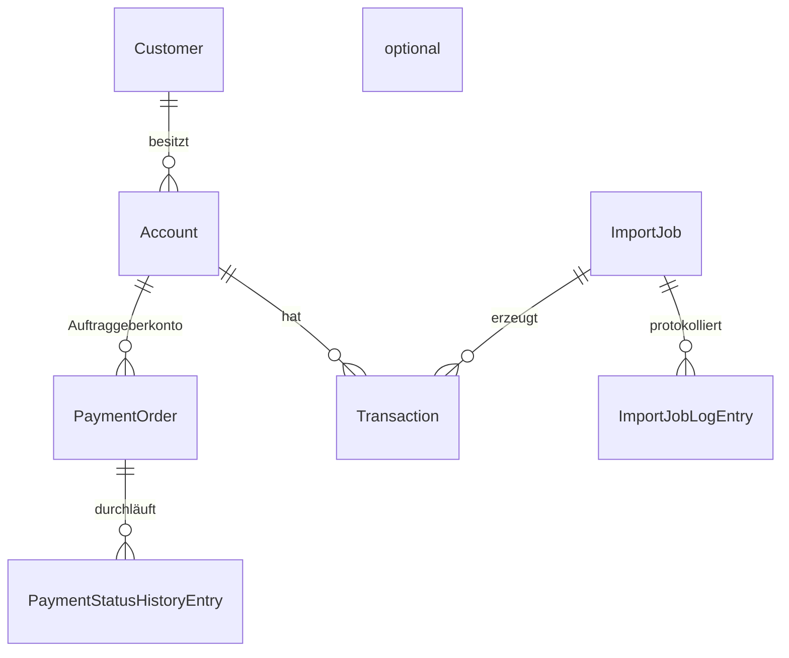

# Fachliche Module & Domain Entities

Jedes Modul ist ein Ordner/Namespace innerhalb der Schichten (z. B. `Banking.Domain.Customers`, `Banking.Application.Customers`), **nicht** ein eigenes Projekt. Das hält die Modular-Monolith-Grenze im Code sichtbar, ohne die Projektzahl unnötig zu erhöhen.

## Modulübersicht

| Modul | Fachliche Verantwortung | Kernfunktionen aus der Anforderung |
|---|---|---|
| **Customers** | Kundenstammdaten verwalten und durchsuchen | Kunden verwalten und suchen |
| **Accounts** | Konten je Kunde, Salden, Kontotypen | Konten einsehen |
| **Transactions** | Buchungen/Transaktionen suchen, filtern, analysieren | Transaktionen suchen und analysieren |
| **Payments** | Zahlungsaufträge anlegen, bearbeiten, deren Status verfolgen | Zahlungsaufträge erstellen/bearbeiten, Zahlungsstatus verfolgen |
| **DataImports** | Batch-/Import-Jobs (z. B. aus Azure Data Factory) überwachen | Import-Jobs überwachen |
| **Auditing** | Nachvollziehbarkeit: wer hat wann was geändert | Audit-Logs einsehen |
| **Diagnostics** | Technische Fehler/Incidents erfassen und analysieren | technische Fehler analysieren |
| **Monitoring** | Systemstatus & Metriken (Health Checks, App-Insights-Aggregation) | Systemstatus und Metriken überwachen |
| **Integrations** | Anti-Corruption-Layer zu SAP (RFC) und externen REST-APIs | SAP RFC, externe REST API |

Abhängigkeiten zwischen Modulen laufen **ausschließlich über Interfaces in der Application-Schicht**, nie direkt auf fremde Domain-Entities oder Datenbanktabellen. Beispiel: `Payments` braucht Kontodaten von `Accounts` → über einen `IAccountLookupService`, nicht über einen direkten Join.

---

## Domain Entities je Modul

### Customers
- `Customer` (Id, Kundennummer, Name, Steuer-/Rechtsform, Status, Adressen, Kontaktdaten)
- `Address` (Value Object)
- `ContactInfo` (Value Object: Telefon, E-Mail)

### Accounts
- `Account` (Id, IBAN, Kundenreferenz `CustomerId`, `AccountType`, `Balance`, `Currency`, Status)
- `AccountType` (Enum: Girokonto, Sparkonto, Kreditkonto, …)
- `Balance` (Value Object: Betrag + Währung, um versehentliches Rechnen mit falscher Währung zu verhindern)

### Transactions
- `Transaction` (Id, `AccountId`, Betrag, Währung, Valutadatum, Buchungstext, `TransactionType`, `TransactionStatus`)
- `TransactionType` (Enum: Lastschrift, Überweisung, Gutschrift, Gebühr, …)
- `TransactionStatus` (Enum: Pending, Booked, Reversed, Failed)

### Payments
- `PaymentOrder` (Id, Auftraggeberkonto, Empfänger-IBAN, Betrag, Ausführungsdatum, `PaymentStatus`, Ersteller, Freigabe-Historie)
- `PaymentStatus` (Enum: Draft, PendingApproval, Approved, Submitted, Executed, Rejected, Failed)
- `PaymentStatusHistoryEntry` (Statuswechsel-Protokoll: alter Status, neuer Status, Zeitpunkt, Benutzer, Grund)

### DataImports
- `ImportJob` (Id, Quelle/Herkunft, Startzeit, Endzeit, `ImportJobStatus`, Anzahl verarbeiteter/fehlerhafter Datensätze)
- `ImportJobStatus` (Enum: Scheduled, Running, Completed, CompletedWithErrors, Failed)
- `ImportJobLogEntry` (Zeile-für-Zeile-Fehler/Hinweise zu einem Import)

### Auditing
- `AuditLogEntry` (Id, Entität + Id, Aktion (Create/Update/Delete), Benutzer, Zeitstempel, Alt-/Neu-Werte als strukturierte Daten)

### Diagnostics
- `TechnicalIncident` (Id, Quelle/Modul, Schweregrad, Fehlermeldung, Stacktrace-Referenz, Korrelations-Id, Status: New/Investigating/Resolved)

### Monitoring
- Kein klassisches Domain-Aggregat – primär Aggregation von Health-Check-Ergebnissen und Application-Insights-Metriken; ggf. `SystemHealthSnapshot` als Read-Model für das Dashboard.

### Integrations
- Keine eigenen Domain-Entities; stellt Interfaces (`ISapCustomerGateway`, `IExternalPaymentGateway`, …) und Anti-Corruption-Layer-Mapping bereit, das externe Formate auf Domain-Entities abbildet.

---

## Beziehungen zwischen den Kern-Entities

**Hinweis zur Pragmatik (DDD "pragmatisch, nicht dogmatisch"):** Wir definieren `Customer` und `Account` als eigene Aggregate mit jeweils eigenem Repository. `PaymentOrder` ist ein eigenes Aggregat, das per `AccountId`-Referenz (nicht per Objekt-Navigation) auf `Account` verweist – das verhindert, dass ein Speichervorgang eines Aggregats versehentlich ein anderes mit ändert, und hält Transaktionsgrenzen klein.
