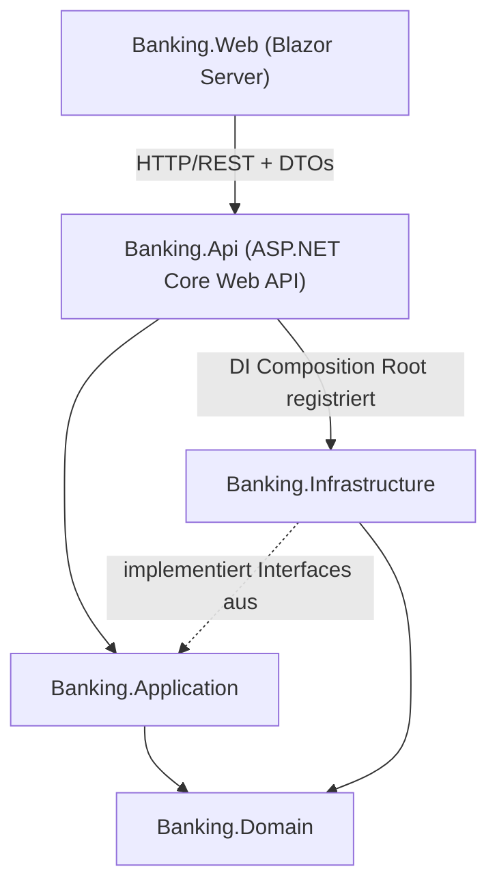

# Banking Operations Portal – Gesamtarchitektur

## 1. Architekturstil: Modular Monolith

Wir bauen bewusst **keinen Microservices-Ansatz**, sondern einen **Modular Monolith**.

**Begründung:**
- Ein Portfolio-Projekt mit Microservices ohne echten Skalierungsdruck erzeugt vor allem Infrastruktur-Overhead (Service Discovery, verteilte Transaktionen, Netzwerk-Latenz, mehrere CI/CD-Pipelines) und lenkt vom eigentlichen Ziel ab: sauberes .NET/C#-Handwerk zu zeigen.
- Die meisten Enterprise-Stellenprofile im Bankenumfeld verlangen zunächst genau das: gut geschnittene Module in einem Monolithen, DDD-Grundlagen, Clean Architecture – Microservices sind meist ein späterer Schritt, kein Einstieg.
- Ein Modular Monolith zeigt trotzdem, dass die Module lose gekoppelt sind und bei Bedarf später herausgelöst werden könnten (Interfaces, klare Grenzen, kein Cross-Module-Datenbankzugriff).

**Interviewfrage, auf die das vorbereitet:** *"Wann würdest du Microservices statt eines Monolithen wählen?"* → Antwort: bei unabhängigen Skalierungs-/Deployment-Anforderungen pro Team/Domäne, nicht als Standardlösung.

## 2. Schichtenmodell (Clean Architecture)

**Abhängigkeitsregel (Dependency Rule):** Pfeile zeigen immer nach innen zur Domain. Domain kennt niemand anderen. Application kennt nur Domain. Infrastructure und Api kennen Application und Domain, aber niemals umgekehrt.

| Projekt | Verantwortung | Darf abhängen von |
|---|---|---|
| `Banking.Domain` | Entities, Value Objects, Domain-Events, Domain-Exceptions, reine Geschäftsregeln – **keine** Frameworks | – (keine Abhängigkeiten) |
| `Banking.Application` | Use Cases (Application Services), DTOs, Interfaces für Repositories/externe Systeme, Validierung, Mapping | `Banking.Domain` |
| `Banking.Infrastructure` | EF Core DbContext, Repository-Implementierungen, SAP-RFC-Adapter, externe REST-Clients, Azure-Integrationen (Key Vault, App Config) | `Banking.Application`, `Banking.Domain` |
| `Banking.Api` | Controller, API-Versionierung, Middleware (Error Handling, Auth), Composition Root (DI-Registrierung), Swagger | `Banking.Application`, `Banking.Infrastructure` (nur zur Registrierung in `Program.cs`) |
| `Banking.Web` | Blazor Server UI, Telerik-Komponenten, typisierte HttpClients zur API | eigene ViewModels/DTOs + generierte API-Clients – **nicht** `Banking.Application`/`Domain`/`Infrastructure` |

## 3. Wichtige Entscheidung: Wie kommuniziert Blazor Server mit dem Backend?

Da Blazor **Server** serverseitig läuft, wäre ein direkter In-Process-Aufruf von `Banking.Application` technisch möglich (kein Netzwerk-Hop).

| Ansatz | Vorteile | Nachteile |
|---|---|---|
| **A: Web → Api via HTTP/REST (empfohlen)** | Realistische Enterprise-Architektur; API ist unabhängig wiederverwendbar (z. B. für ein künftiges Mobile-Frontend oder externe Systeme); zeigt REST-API-Design, DTOs, Versionierung, Auth-Flows – genau die Skills, die in Stellenanzeigen gefordert werden; Web und Api sind unabhängig deploybar/skalierbar | Zusätzlicher Netzwerk-Hop, Serialisierungs-Overhead, mehr Boilerplate (typisierte HttpClients) |
| **B: Web → Application in-process** | Einfacher, schneller, weniger Code | Verwischt die Trennung UI/Backend; keine wiederverwendbare API; entspricht nicht dem, was in Stellenausschreibungen für "ASP.NET Core Web API"-Erfahrung gesucht wird |

**Entscheidung:** Ansatz A. `Banking.Web` referenziert **nur** generierte/typisierte API-Clients und eigene View-DTOs, niemals `Banking.Application` direkt. Das ist eine bewusste Trade-off-Entscheidung zugunsten von Lernwert und Realismus, nicht Performance.

*Wird als ADR-0002 formalisiert, siehe [decisions-backlog.md](../adr/decisions-backlog.md).*

## 4. Cross-Cutting Concerns (Überblick – Details folgen phasenweise)

- **Fehlerbehandlung:** zentrale Exception-Middleware in `Banking.Api`, Rückgabe als `ProblemDetails` (RFC 7807), keine Leak von Stacktraces in Prod.
- **Logging/Observability:** strukturiertes Logging (Serilog) mit Correlation-IDs, Sink nach Application Insights.
- **Validierung:** in `Banking.Application` (z. B. FluentValidation), nicht im Controller und nicht in Blazor-Komponenten.
- **Security:** Authentifizierung über Azure AD/Entra ID (OpenID Connect), Autorisierung über Policies/Rollen, keine eigene Passwortverwaltung.
- **Konfiguration & Secrets:** `appsettings.json` nur für unkritische Defaults, Secrets ausschließlich über Azure Key Vault (via Managed Identity), zentrale Konfiguration über Azure App Configuration.
- **API-Versionierung:** URL-basiert (`/api/v1/...`), da am expliziten und für ein Portfolio-Projekt am leichtesten nachvollziehbar.

Details zu jedem Punkt folgen als eigene ADRs bzw. in den jeweiligen Implementierungs-Schritten.
